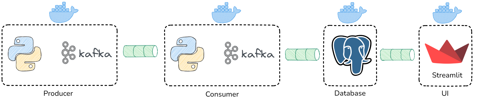
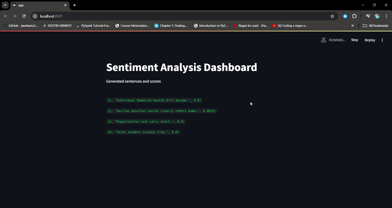

## Data streaming showcase using Kafka (Python API), PostgreSQL, Streamlit

In this simple data streaming project, 
 - In producer service the fake data (a senetence) is generated and sent to the kafka topic every 5 seconds.
 - In consumer service kafka consumer consume messages from a Kafka topic, analyze their sentiment using the VADER Sentiment Analysis tool from NLTK, and then store the results in a PostgreSQL database.
 - In the UI, there is a streamlit dashboard that fetches data from a PostgreSQL database and displays the results on a live dashboard, updating the information in real time.

### Architecture of the project




To implement the project in your machine follow the steps below. First, make sure you have Docker installed on your machine.

```
mkdir my_project
cd my_project
```
```
git clone https://github.com/Shixi99/data-streaming-kafka.git
cd data-streaming-kafka
```
Add .env file to **ui** folder
```
DB_HOST=your_postgres_hostname
DB_NAME=your_postgres_db_name
DB_USER=your_postgres_username
DB_PASS=your_postgres_password
DB_PORT=5432
```
Add .env file to project folder (data-streaming-kafka)
```
POSTGRES_USER=your_postgres_username
POSTGRES_PASSWORD=your_postgres_password
POSTGRES_DB=your_postgres_db_name
DB_NAME=your_postgres_db_name
DB_USER=your_postgres_username
DB_PASSWORD=your_postgres_password
```

Start docker containers
```
docker-compose up -d
```
Stop docker containers
```
docker-compose stop
```
Or stop and remove containers
```
docker-compose down
```
